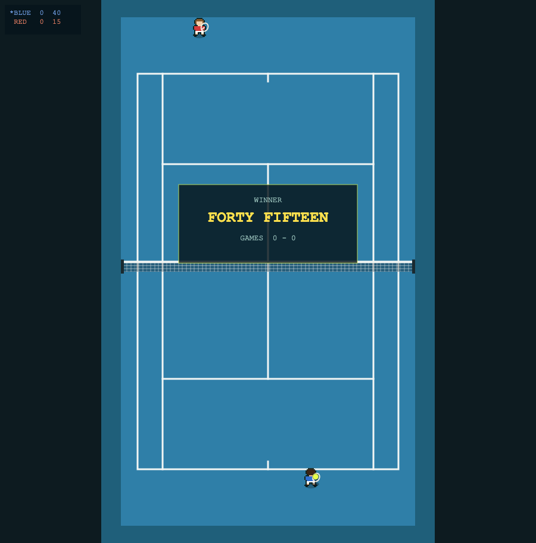
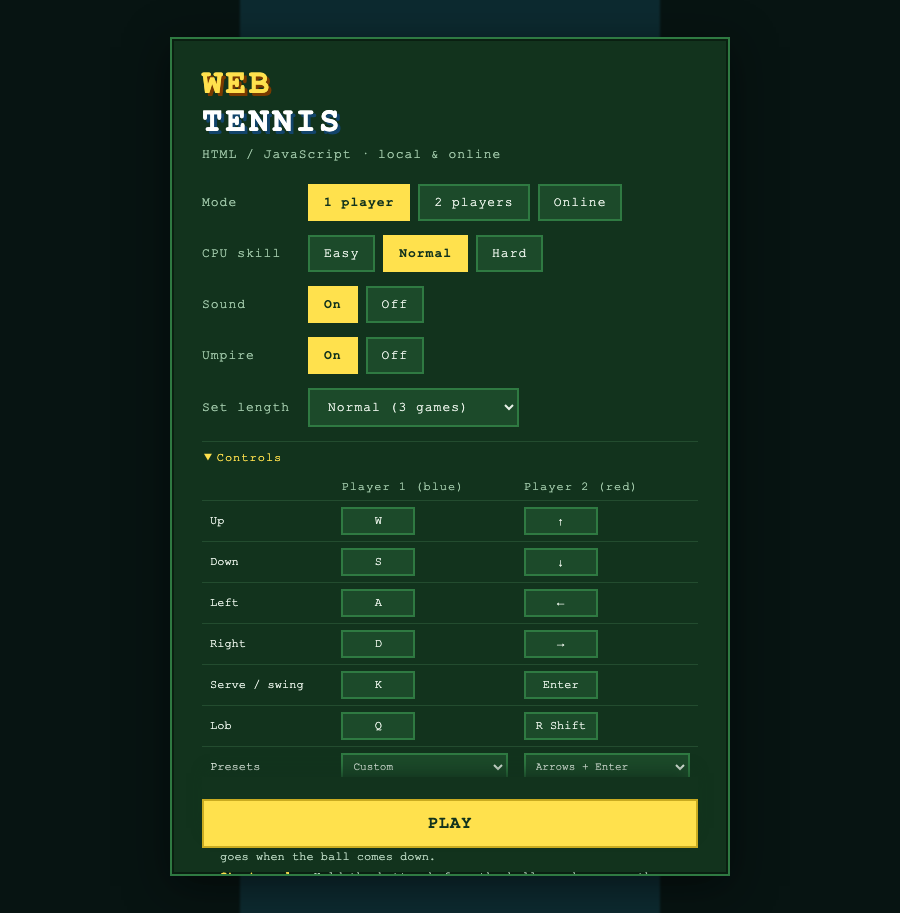

# WebTennis

Arcade tennis in the browser, in the spirit of the 16-bit classics: a court seen
from above, two small players, one button, and a ball that has to land in.
**1 player against the CPU**, **2 players on one keyboard**, or **online** with a
four-character room code.

No dependencies, no build step. HTML, CSS and JavaScript exactly as the browser
receives them.



It is the second game built this way. The first is
[websoccer](https://github.com/markclausing/websoccer), and the two share their
engine — see [Shared with websoccer](#shared-with-websoccer).

## Getting started

```bash
git clone https://github.com/markclausing/webtennis.git
cd webtennis
npm start
```

Then open http://localhost:5173/. There is no `npm install`; there are no
packages to install.



## Controls

|              | Player 1 (blue) | Player 2 (red) |
| ------------ | --------------- | -------------- |
| Move         | `W A S D`       | Arrow keys     |
| Serve / hit  | `Space`         | `Enter`        |
| Pause        | `Esc`           |                |

- **Serving** is two presses: one throws the ball up, the second hits it. You
  get two serves, and the second one is worth taking care over.
- **Hold** the button to hit harder. Hold longer still and the ball goes up
  instead of through — a lob, for when your opponent is at the net.
- **Start early.** Holding the button is winding up, not waiting to fire: the
  shot goes off by itself when the ball arrives, with however much wind-up you
  have by then. The longer you have been holding, the harder you hit it *and* the
  closer it goes to where you aimed — a shot thrown at the ball at the last
  moment sprays. On screen that is the bar under your player and the racket going
  back behind him.
- **Nothing tells you where the ball will land.** Read the shadow: it spreads and
  fades as the ball climbs, and draws in tight and dark as it drops. That, and a
  faint mark under your player when the ball is in reach, is all the help there
  is - judging depth and picking your moment is the game.
- **Nothing tells you how hard you are hitting it either.** The racket does: back
  and down as you wind up, through the ball on contact. A bar with a number's
  worth of precision in it was doing the judging for you.
- **Steer while you swing** to place it: sideways sends it across the court,
  forward drives it deep, back drops it short. **Keep steering for a second after
  contact** and the ball bends in the air. Aim alone cannot put the ball out -
  the stick moves you as well as aiming the shot, so the direction you are
  holding to reach the ball should not fling it past the sideline. Going for the
  lines takes aftertouch, which is a thing you choose to do.
- **Lob** puts it over somebody standing at the net.
- **Every key can be changed** in the menu, or take a preset.
- On a phone you get a stick and two buttons, and the court is drawn *above*
  them rather than behind them: this game is played upright, so the bottom of
  the screen is your own baseline and a thumb parked over your own player is no
  way to play. Nothing asks you to turn the phone sideways - a tennis court is
  taller than it is wide.

The rules are the real ones, because they are what makes tennis tennis: the ball
has to land in, it may bounce once, a serve has to find the diagonal box, and the
score runs fifteen, thirty, forty, deuce, advantage. A set is won by two clear
games.

## How it plays

Three difficulty settings, and what separates them is measured rather than
guessed. The strongest lever is a delay before the CPU sets off after the ball —
reading the shot early is most of what makes a good player look quick. The second
is how far its aim strays, **and that aim is allowed to stray past the lines**.
That last part sounds like a detail and is not: an earlier version clamped every
shot into the court, which meant the CPU could not miss, made no errors at any
level, and easy and hard finished level with each other. Games taken off HARD
over four matches: EASY 6, NORMAL 17, HARD 22.

Points end the way they do in tennis: at HARD against itself, 93% of them are
winners and 7% aces; against EASY, a quarter of the points are errors.

## Shared with websoccer

Eleven files are identical in both games — the input mask, the touch controls,
the lockstep netcode, the relay, the Cloudflare Worker, the high score table, the
three-letter name entry, the formant speech synthesiser and the maths. They are
shared by being the same file in both repositories rather than by a package,
because neither game has a build step and neither is going to grow one for this.

Copying is only worth anything if somebody notices when the copies part ways:

```bash
node tools/sync-shared.js          # are they still the same?
node tools/sync-shared.js --pull   # take websoccer's copy
node tools/sync-shared.js --push   # send this one back
```

It runs as part of `npm test`, so a change on one side shows up as a failing test
on the other rather than as a mystery six months later. It expects websoccer to
be checked out beside this repository, and says so and passes if it is not.

Nothing that knows what sport it is gets shared. The simulation, the court, the
sounds and the words are each game's own — a shared file full of `if (tennis)`
would be worse than two files.

## The umpire

The score is called out loud by the same formant synthesiser websoccer uses for
its commentator: a buzz through three sharp filters, which is roughly what the
speech chips of the era did. The voice is shared; the words are not. Tennis is
the easy case for a talking scoreboard, because the calls have not changed in a
century — love, fifteen, thirty, forty, deuce, advantage, game.

## Tests

```bash
npm test              # the lot
npm run test:sim      # whole matches headless: determinism, scoring, the rules
npm run test:shared   # the shared files, against websoccer next door
```

The scoring is tested by driving points straight through the scorer rather than
by playing, because deuce, advantage and advantage-lost take a long time to reach
by playing and are exactly where a scoreboard goes subtly wrong.

## What is not there yet

- No tiebreak: a long set is settled by the first player to get two games past
  the target rather than at seven points.
- No doubles, no second set, no tournament.
- The CPU plays from the baseline and does not come to the net.
- The players are the football game's figures with a racket drawn on. They will
  do until somebody draws a tennis player.
- No icons and no title screen art yet.
- The CPU never comes to the net, so there is no serve and volley to play
  against.

## The relay

Online play and the shared high score board run on a Cloudflare Worker of this
game's own — the same code websoccer uses, deployed separately on purpose. The
board lives in a single Durable Object under one key, so one Worker serving both
games would mean one table with football and tennis results mixed into it. Two
Workers, two boards. They post into the same Discord channel, which is only a
webhook address and does not care which game is talking.

```bash
cd worker && npx wrangler login && npx wrangler deploy
npx wrangler secret put DISCORD_WEBHOOK   # optional: announce new entries
npx wrangler secret put ADMIN_KEY         # optional: lets you clean the board
```

Then put the address it prints in `src/config.js` as `DEFAULT_RELAY`, with
`wss://`.

## Licence

[MIT](LICENSE).

An original tribute to the top-down sports games of the nineties: no code,
artwork or other parts of any existing game, and no affiliation with their makers
or rights holders.
